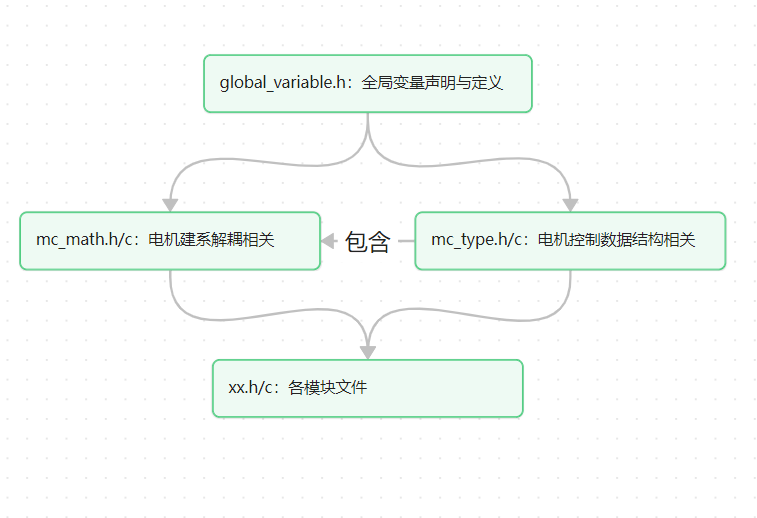

# Electric_vehicle
Electric vehicle project-2025.11

# 软件组织结构

芯片：LKS32MC071C8T8

# 一、FOC底层算法(lks)
    1.参考系
        (1)右手系beta轴向下为正
        (2)电角度为q轴与alpha轴夹角
        (3)0电角度为q轴与alpha轴重合方向(即对应A相BEMF最大值与HALLA对齐)
        (4)转子永磁体d轴定义内部磁场S->N为正方向
        
    2.标幺化量确定
        (1)位置信息
            (1.1)电角度θ：Q15∈(-32768,32767)
            (1.2)电角速度：θ/T(周期计数)

        (2)电压基准值
            (2.1)alpha-beta系Udc=2/3*Vdc,矢量圆Ux=Udc*sqrt(3)/2=Vdc/sqrt(3),标幺值Q15

        (3)电流基准值
            (3.1)相电流采样Q15

    3.线性系统解耦
        (1)坐标变换：clarke park invclarke invpark transform
        (2)电角度查表法求正弦值

    4.SVPWM(过调制I II区)
        (4.1)虚拟电角度发波,测试硬件(I/F负载强拖启动)
        (4.2)调制系数Ux/(Vdc/2)=1.154为基准,线性区∈(0,1),I区∈(1,1.102),II区∈(1.102,1.154) 比如:放大Q15*1.102

    5.电流环

    6.速度环

    7.功率环(保护环)
        (7.1)P=Udc*Idc，P_in与P_max关系->限制速度环输出的Iq_ref
